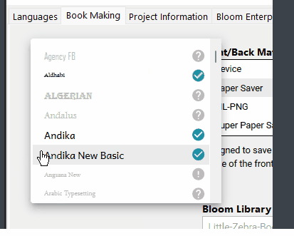

If you embed a gif in notion, it should be embedded in Docusaurus

## Imgur {#2483d202ecf040658708c46a35a61372}

## Giffy,  {#b2700367aba242b98deb6cd2cbb6049e}

When it detects an embedded gif, docu-notion does the following:

- Adds a `import GifPlayer from "react-gif-player";` to the markdown.
- Inserts html like `<GifPlayer gif="https://media.giphy.com/media/VhiAuDYHkNPydiNnOs/giphy.gif" />`

:::info

If your site is not based on `docu-notion-sample-site`, you may need to add react-gif-player to your Docusaurus project:
`yarn add react-gif-player` or `npm i react-gif-player`

:::

